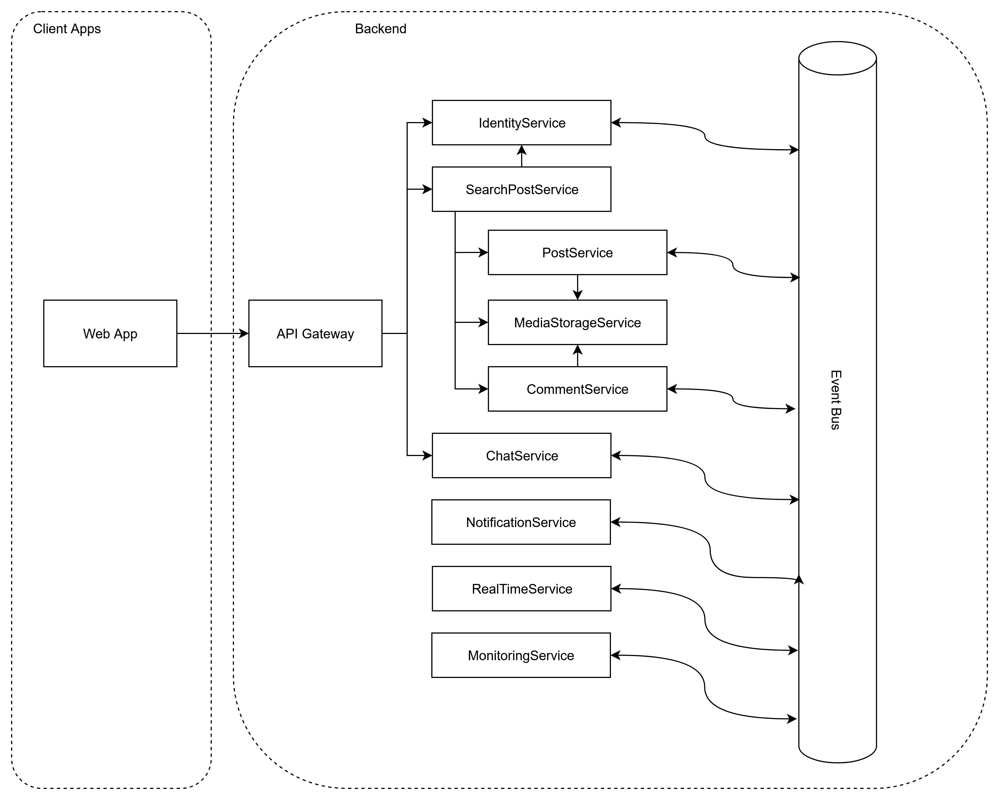
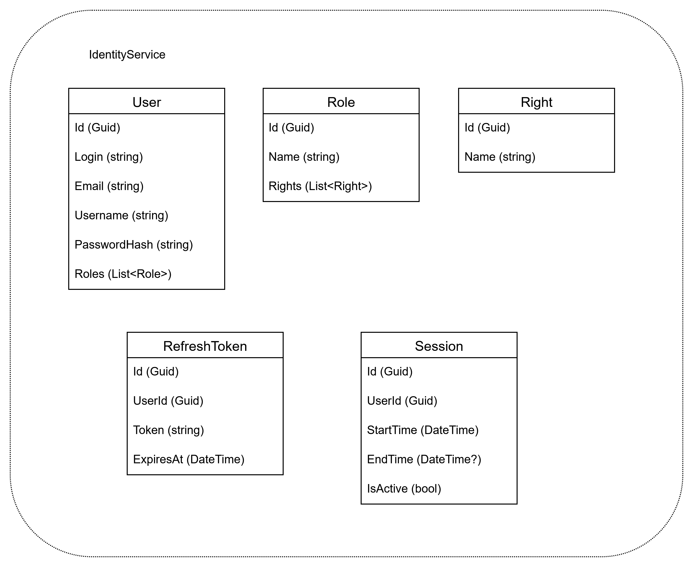

# Форум на микросервисной архитектуре

Задача - реализовать работоспособный форумный сервис на базе микросервисной архитектуры. 
Каждый микросервис будет реализовывать свой архитектурный паттерн (трехслойная архитектура, DDD/onion-архитектура и т.д.) 

Функциональные требования:

1. Регистрация и авторизация: 
    - Пользователь может зарегистрироваться на форуме, указав свой ник, логин, email (необязательно) и пароль.
    - Авторизация происходит по логину (или email) и паролю. Должна быть возможность восстановить пароль по email.
      - Авторизация по номеру телефона или telegram? 
3. Профиль пользователя:
    - Авторизованный пользователь может изменить свой ник, добавить аватарку, информацию о себе. 
2. Создание постов и комментарии: 
   - Авторизованный пользователь может создать пост, другие авторизованные пользователи могут оставлять свои комментарии к посту. На комментарии можно отвечать.
   - К постам и комментариям можно прикрепить фото, видео или аудио материал (до 10).
   - Пост и комментарии могут быть отредактированы авторами.
     - История изменений и возможность отката версии? 
   - У поста и комментария есть рейтинг - сколько зарегистрированных пользователей поставили + или -.
3. Разделы, теги, поиск постов и фильтры:
   - Изначально посты отображаются в единой ленте.
   - Пост принадлежит одному из разделов, определенных заранее админом. Имеется фильтрация постов по разделам.
     - Автор может добавить кастомные фильтрационные теги для поста?
     - Фильтрация постов по рейтингу, кол-ву комментариев?
   - Полнотекстовый поиск поста по сервису.
4. Права и роли: 
   - Пользователи могут иметь роли, которые в свою очередь могут иметь особые права (модератор раздела, запрет постинга/комментирования определенных разделов). Часть ролей могут отображаться у пользователя в профиле.
     - Права для пользователя напрямую без ролей?
     - Пользователь может сам определять, какие роли будут отображаться в профиле?
     - Особые роли разделов (отображаются только в соответствующем разделе)? 
     - Система рангов или кармы для пользователей?
   - Модератор раздела может удалять посты и комментарии в соответствующем разделе.
     - Универсальная роль админа на все разделы? 
5. Чат:
   - Авторизованные пользователи могут писать личные сообщения друг другу, функционал должен поддерживать фичи комментариев. 
     - Создание чатов с несколькими пользователями?
     - Возможность добавлять в друзья других пользователей?
     - Блокировка пользователя?
6. Уведомления и подписка на пост:
   - Если пользователю отвечают на комментарий или в чате, то к нему приходит уведомление об этом.
     - Отключение уведомлений в лс и в комментариях? 
   - Пользователь может подписаться на пост и получать уведомления о новых комментариях под постом.
   - Если пользователь не авторизован на сайте, то уведомления будут приходить на его email.
     - Уведомления в telegram / sms?
     - Отключение уведомлений через почту?
7. Система должна быть RealTime.
8. Мониторинг событий?
9. Блок с рекламой?

Сервисы: TODO
1. IdentityService (Регистрация и авторизация + Профиль пользователя + Права и роли)
3. PostService (Создание постов и комментарии + Разделы, теги, поиск постов и фильтры)
   - CommentSerive для комментариев?
   - SearchService для поиска?
   - MediaStorageService для хранения медиаконтента?
5. ChatService (Чат)
5. NotificationService (Уведомления и подписка на пост)
6. RealTimeService (Система должна быть RealTime)
7. MonitoringService?

Прототип дизайна:

[прям совсем-совсем прототип.png](img/1main.png)

System Design:

IdentityService.
Сущности (Entities)

REST 
### IdentityApi — REST Endpoints

| Метод      | Endpoint                        | Описание                                                        |
|------------|---------------------------------|-----------------------------------------------------------------|
| **POST**   | `auth/register`                 | Регистрация нового пользователя (`email`, `login`, `password`). |
| **POST**   | `auth/login`                    | Вход в систему (`email` или `login`, `password`).               |
| **POST**   | `auth/refresh`                  | Обновление `access_token` по `refresh_token`.                   |
| **POST**   | `auth/logout`                   | Выход, инвалидирует `refresh_token`.                            |
| -------    | ----------                      | ----------                                                      |
| **GET**    | `user/{id}`                     | Получение информации о пользователе.                                  |
| **PUT**    | `user/{id}`                     | Обновление информации о пользователе (`username`). |
| **DELETE** | `user/{id}`                     | Удаление пользователя.                   |
| -------    | ----------                      | ----------                                                      |
| **POST** | `/api/roles` | Создание новой роли. |
| **GET** | `/api/roles/{id}` | Получение информации о роли. |
| **PUT** | `/api/roles/{id}` | Обновление информации о роли. |
| **DELETE** | `/api/roles/{id}` | Удаление роли. |
| -------    | ----------                      | ----------                                                      |
| **POST** | `/api/user-roles` | Назначение роли пользователю. |
| **GET** | `/api/user-roles/{userId}` | Получение ролей пользователя. |
| **DELETE** | `/api/user-roles/{userId}/{roleId}` | Удаление роли у пользователя. |
| -------    | ----------                      | ----------                                                      |
| **POST** | `/api/rights` | Создание нового права. |
| **GET** | `/api/rights/{id}` | Получение информации о праве. |
| **PUT** | `/api/rights/{id}` | Обновление информации о праве. |
| **DELETE** | `/api/rights/{id}` | Удаление права. |